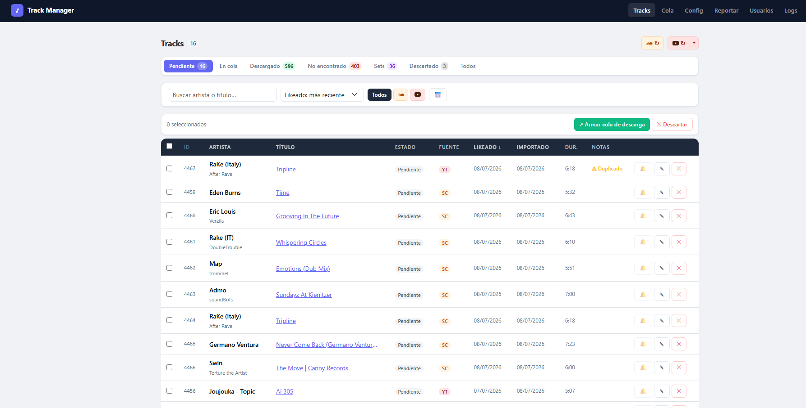
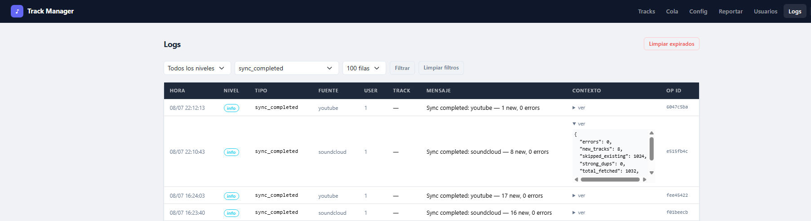

# Track Manager


A self-hosted web app for DJs to collect, organize, and manage liked tracks from SoundCloud and YouTube.

## Why this exists

As a DJ, I needed a single place to track and organize the music I like across multiple platforms, without manually cross-checking each track by hand. This app automates that workflow — from liking a track to having clean, deduplicated, tagged metadata organized in one library.

> **Note:** Spotify was originally planned as a third source, but Spotify restricted its developer API access before that integration could be completed, so it was removed from scope. The ingestion architecture is source-agnostic — adding a new platform back in mainly means writing a new collector, since the normalization and dedup pipeline stays the same.

It started as a personal tool to solve my own workflow problem, and grew into a full backend system with multi-source ingestion, data normalization, deduplication, and an optional, configurable acquisition step per deployment.

## How it works

```
[SoundCloud / YouTube]
              ↓  (collectors)
     [Raw Track Ingestion]
              ↓  (normalization)
  [Clean Metadata + Fingerprint]
              ↓  (deduplication)
      [Review Queue]
              ↓  (approved)
[Optional acquisition step — configurable per deployment]
              ↓
  [Organized Library (YYYY/YYYY-MM/)]
```

## Screenshots

**Track review workflow** — pending tracks pulled from SoundCloud and YouTube, with fuzzy-match duplicate detection flagging candidates before they enter the library.



**Structured sync logging** — every sync run logs source, counts, and dedup stats (`new_tracks`, `skipped_existing`, `strong_dups`) as structured, queryable events.



## Technical highlights

- **Multi-source data ingestion** with a unified normalization pipeline across independent external APIs
- **Confidence-scored fuzzy deduplication** using configurable similarity thresholds to avoid both false positives and false negatives
- **Pluggable acquisition step**, configurable independently per deployment, decoupled from ingestion and review
- **Session-based multi-user authentication** with role management (admin / DJ)
- **Schema migrations via Alembic**, supporting safe iterative development instead of destructive resets

## Features

- **Multi-source sync** — SoundCloud, YouTube
- **Metadata normalization** — cleans titles, splits artist/title, strips promo noise, detects remix versions
- **Deduplication** — fuzzy fingerprint matching flags duplicates before they enter the library
- **Review workflow** — pending → queue → resolved, with manual metadata editing
- **Library organization** — optionally organizes entries into `YYYY/YYYY-MM/` groups by like date
- **Multi-user auth** — username + password login, admin user management
- **Settings UI** — configure all credentials and options from the browser

## Stack

| Layer | Tech |
|---|---|
| Backend | FastAPI + SQLAlchemy 2 |
| Database | SQLite (default) or PostgreSQL |
| UI | Jinja2 + Bootstrap 5 |
| Dedup | rapidfuzz |
| Auth | itsdangerous + PBKDF2-SHA256 |

## Quick Start

### 1. Prerequisites
- Python 3.11+

### 2. Install
```bash
git clone https://github.com/mateorebuffo/TrackManager.git
cd TrackManager
python -m venv .venv

# macOS / Linux
source .venv/bin/activate

# Windows
.venv\Scripts\activate

pip install -r requirements.txt
```

### 3. Configure
```bash
cp .env.example .env
# Edit .env with your credentials
```

### 4. Run
```bash
uvicorn app.main:app --reload
```

Open `http://localhost:8000` — on first run you'll be prompted to create an admin account.

## Configuration

All settings can be edited at `/settings` in the UI or directly in `.env`.

| Variable | Description |
|---|---|
| `DATABASE_URL` | SQLite (default) or PostgreSQL connection string |
| `SOUNDCLOUD_CLIENT_ID` | SoundCloud API client ID |
| `SOUNDCLOUD_OAUTH_TOKEN` | SoundCloud OAuth token |
| `YOUTUBE_CLIENT_ID` | Google OAuth client ID |
| `YOUTUBE_CLIENT_SECRET` | Google OAuth client secret |
| `LIBRARY_DIR` | Base folder for the organized library |
| `ORGANIZE_BY_LIKE_DATE` | `true` — organize entries into `YYYY/YYYY-MM/` subfolders |
| `DEDUP_STRONG_MATCH_SCORE` | Similarity threshold for definite duplicates (default `90.0`) |
| `DEDUP_WEAK_MATCH_SCORE` | Similarity threshold for possible duplicates (default `75.0`) |

> Note: changes to `.env` require a server restart.

## Project Structure

```
app/
├── main.py                   # App entry point, middleware, router registration
├── config.py                 # Settings (pydantic-settings)
├── db.py                     # SQLAlchemy engine + session
├── auth_middleware.py        # Session-cookie auth middleware
├── models/
│   ├── source_track.py       # Raw imported track
│   ├── normalized_track.py   # Parsed + cleaned track
│   ├── review_item.py        # Workflow state + TrackStatus enum
│   └── user.py               # User accounts
├── collectors/               # Source-specific importers (SoundCloud, YouTube)
├── services/
│   ├── ingestion.py          # Full sync pipeline orchestrator
│   ├── normalization.py      # Metadata parsing pipeline
│   ├── deduplication.py      # Fingerprint-based dedup
│   └── auth.py               # Password hashing + session tokens
├── api/
│   ├── sync.py                # Sync endpoints
│   ├── tracks.py               # Pending tracks UI + API
│   ├── review.py               # Review actions
│   ├── auth.py                  # Login / logout / user management
│   └── settings_page.py         # Settings UI
├── templates/                 # Jinja2 + Bootstrap 5 HTML
└── utils/
    ├── text.py                 # Title cleaning, fingerprinting
    └── fs.py                   # Cross-platform path helpers
alembic/                        # DB migrations
requirements.txt
.env.example
```

## User Management

The first time you start the app with an empty database you'll be redirected to `/setup` to create an admin account.

Admins can manage users at `/admin/users`:
- Create new users (DJ or admin role)
- Reset passwords
- Delete accounts

## Database Migrations

Tables are auto-created on startup. For schema changes:
```bash
alembic revision --autogenerate -m "description"
alembic upgrade head
```

## Track Statuses

| Status | Meaning |
|---|---|
| `pending` | Imported, waiting for review |
| `queued` | Added to the acquisition step |
| `resolved` | Successfully processed |
| `not_found` | Not found via the configured acquisition step |
| `set_mix` | Duration > 35 min — treated as a DJ set |
| `discarded` | Manually discarded |

## Roadmap / Ideas

- [ ] Add a similarity-based recommendation layer (using the existing fingerprinting logic as a base) to suggest new tracks based on library taste
- [ ] Expose a lightweight natural-language query interface over the track library
- [ ] Docker Compose setup for one-command deployment

## License

MIT
